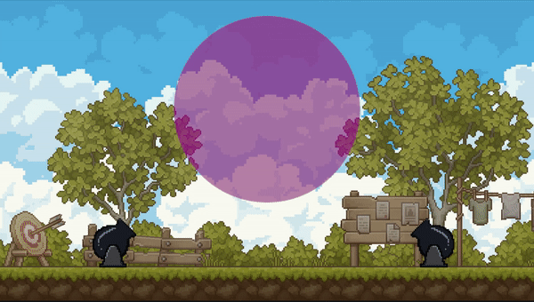

# Тестовое задание для Crazy Panda

## Задача:

Задана 2д сцена с Box2d физикой.
На разных концах сцены стоят 2 пушки, который стреляют в центр снарядами с медленной скоростью.
В центре экрана находится круглая область, все объекты , которые попали в неё время замедляются в 10 раз.
Требуется написать код, который реализует данную область с учетом столкновения снарядов и гравитации.
